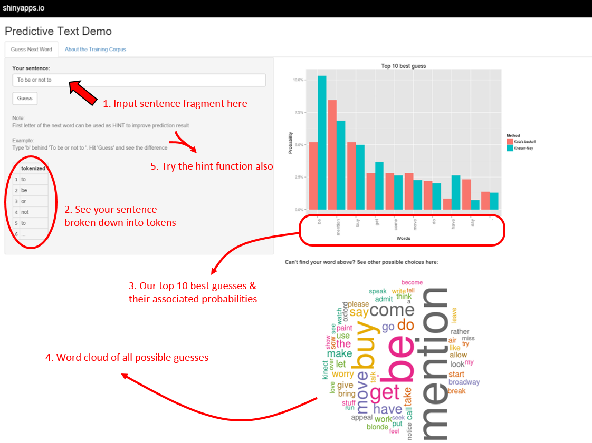

## Data Science Capstone
Building a Predictive Text Application

Here I posted the codes of the Predictive Text Model I built for my Data Science Capstone Project. R scripts should be run in the sequence:

1. Preprocessing.R
2. Training.R
3. Modelling.R
4. Testing.R

**Preprocessing.R** contains the script that preprocess the raw corpus from the *raw* folder into cleaned tokenized form. As running time is long, I have provided the preprocessed training data in the *res* folder therefore no need for you to run this script.

**Training.R** builds a n-gram language model from the tokenized corpus. I stop at 4-gram but included continuation probabilities so Kneser Ney can implemented.

**Modelling.R** implements Katz's backoff and Knesey Ney algorithms to calculate word probability and predict mostly word.

**Testing.R** evaluates the performance of our language model by calculating its perplexity.

Final model is presented on a Shiny app with HTML slide deck for added explanation.

Links below:
- Check out my app [here](https://yongjun21.shinyapps.io/PredictiveTextDemo)
- And my [slide deck](https://rpubs.com/yongjun21/CapstoneProjectFinalPres)
