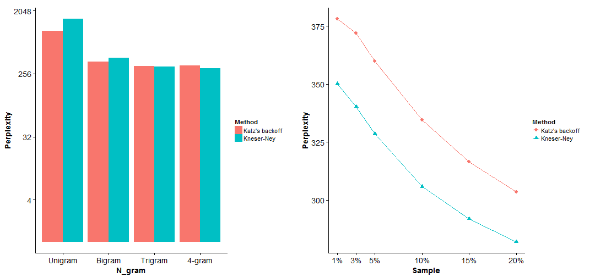

Data Science Capstone - Building a Predictive Text Application
========================================================
author: Yong Jun
date: 22 Aug 2015

The Data & The Problem
========================================================

### *"To be or not to ???"*
  
- Using a freely downloadable English text corpus, we will build a **Predictive Text Model** that takes in sentence fragments as input and output prediction of the **next word**.
- Our training corpus is sampled from Hans Christensen's HC Corpora which comprises 102 million words & 7 million English sentences taken from 3 online sources namely Blogs, News and Tweets.  
- Final model will be showcased on a Shiny Application.

The Approach
========================================================
Our Language Model can be described as follows:

1. **Simplistic** 

Within the context, only the word tokens itself is used as feature; model doesn't take into account the topic or mood

2. **Probabilistic** 

Instead of outputting a single prediction, model outputs a probability distribution of likely words

3. **Based on an N-gram model** 

Sentences are assumed to follow a Markov process: each word depends only on the last n-1 words

4. **Smoothing used to improve estimates**
<ol style="font-size:70%;line-height:100%">
  <li>Assign non-zero probability to n-gram not observed in training</li>
  <li>Overcome data sparsity by making use of lower-order n-grams to fill information gaps in higher-order model</li>
</ol>
The Methods
========================================================

**Katz's backoff**

$P_{Katz}(w_{i}\mid w_{i-n+1}^{i-1}) =$

$$\begin{cases} 
d \cdot P_{MLE}(w_{i}\mid w_{i-n+1}^{i-1}) \\ _{\text{if } C(w_{i-n+1}^{i})>0} \\ \\
\lambda \cdot P_{Katz}(w_{i}\mid w_{i-n+1}^{i-2}) \\ _{\text{otherwise}} 
\end{cases}$$

<ul style="font-size:50%;line-height:120%">
<li>Maximum Likelihood Estimate (MLE): 
Count of n-gram divided by total count across all n-grams having the same context</li>
<li>d = discount factor</li>
<li>&#955 = probability mass shifted</li>
<li>Uses discounted MLE for observed n-grams. Backoff to smaller n-gram for n-grams not observed in training</li>
</ul>
  
***

**Kneser-Ney** (Interpolation)

$$\begin{align*}P_{KN}(w_{i}\mid w_{i-n+1}^{i-1})
&= \frac{C(w_{i-n+1}^{i})-D}{\sum_{w_{i}}C(w_{i-n+1}^{i})} \\
&+ \lambda \cdot P_{KN}(w_{i}\mid w_{i-n+1}^{i-2}) \end{align*}$$

$\text{where } C(w_{i-n+1}^{i}) =$

$$\begin{cases} 
\text{freq count} & _{\text{highest order}} \\ 
\text{N(unique histories)} & _{\text{lower orders}} 
\end{cases}$$
  
<ul style="font-size:50%;line-height:120%">
<li>Count is discounted to shift some probability mass to lower-order model for interpolation</li>
<li>
Probability estimate of lower-order n-grams obtained by counting no. of unique histories instead of taking MLE
</li>
</ul>

The Application
========================================================

Testing Result
========================================================

 

<ul style="font-size:70%;line-height:100%">
<li>Model evaluated using Perplexity</li>
<li>Perplexity continues to decrease as size of training set increases</li>
<li>However, shinyApp server has limited memory available</li>
<li>Lowest perplexity achieved on a 10% sampling of training corpus is 305 using a 4-gram Kneser-Ney model</li>
</ul>
